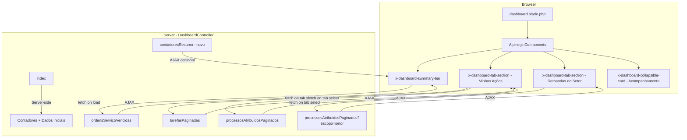
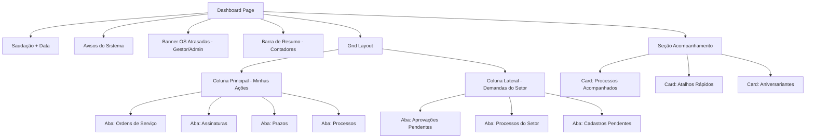

# Design Document: Dashboard Admin Redesign

## Overview

Este design descreve a reorganização da dashboard administrativa do InfoVISA, transformando o layout atual de 3 colunas com cards espalhados em uma interface estruturada com barra de resumo, seções tabuladas e informações secundárias colapsáveis.

A abordagem é **incremental**: reutilizamos o `DashboardController` existente e seus endpoints AJAX, reorganizando a camada de apresentação (Blade + Alpine.js) e adicionando novos endpoints apenas quando necessário. O controller será refatorado para extrair lógica em métodos menores e mais coesos, mas sem reescrita completa.

### Decisões de Design Principais

1. **Manter o controller existente** — Refatorar `DashboardController.php` em vez de criar um novo. Extrair lógica de contagem para um método dedicado `contadoresResumo()` que alimenta a barra de resumo.
2. **Blade components** — Criar Blade components (`x-dashboard-summary-bar`, `x-dashboard-tab-section`, `x-dashboard-collapsible-card`) para encapsular a UI reutilizável.
3. **Alpine.js para estado de abas** — Usar Alpine.js (já presente no projeto) para gerenciar estado de abas, lazy loading e persistência via `localStorage`.
4. **Lazy loading por aba** — Cada aba carrega dados via AJAX apenas quando selecionada pela primeira vez, reutilizando os endpoints existentes (`tarefasPaginadas`, `processosAtribuidosPaginados`, `ordensServicoVencidas`).
5. **Layout condicional por perfil** — Tailwind CSS grid com `lg:grid-cols-3` para gestores/admin (main 2/3 + sidebar 1/3) e coluna única para técnicos.

## Architecture

### Visão Geral da Arquitetura



### Hierarquia de Layout



### Fluxo de Carregamento

1. **Server-side (index)**: Renderiza o HTML com contadores pré-calculados, avisos do sistema, saudação e estrutura de abas. Dados pesados (listas) NÃO são carregados no `index()`.
2. **Client-side (Alpine.js)**: Ao carregar a página, a primeira aba de cada seção dispara uma requisição AJAX para buscar seus dados.
3. **Lazy loading**: Abas subsequentes só carregam quando selecionadas. Dados são cacheados no componente Alpine para evitar re-fetches desnecessários.
4. **Persistência de estado**: A aba ativa e o estado dos cards colapsáveis são salvos em `localStorage` e restaurados no carregamento.

## Components and Interfaces

### 1. DashboardController (Refatorado)

**Arquivo**: `app/Http/Controllers/Admin/DashboardController.php`

#### Método `index()` — Simplificado

Responsabilidades reduzidas:
- Calcular contadores para a Barra de Resumo (OS ativas, docs pendentes assinatura, docs com prazo, processos diretos)
- Contadores adicionais para gestores (docs pendentes aprovação do setor, cadastros pendentes)
- Carregar avisos do sistema
- Carregar dados de aniversariantes
- Retornar a view com dados mínimos (contadores + metadados)

```php
// Dados retornados para a view
return view('admin.dashboard', [
    'contadores' => [
        'os_ativas' => $countOS,
        'docs_assinatura' => $countDocsAssinatura,
        'docs_prazo' => $countDocsPrazo,
        'processos_diretos' => $countProcessosDiretos,
        // Apenas para gestores/admin:
        'docs_aprovacao_setor' => $countDocsAprovacao,
        'cadastros_pendentes' => $countCadastros,
    ],
    'urgencias' => [
        'os_atrasadas' => $countOSAtrasadas,
        'docs_vencidos' => $countDocsVencidos,
        'docs_aprovacao_atrasados' => $countDocsAprovacaoAtrasados,
    ],
    'avisos_sistema' => $avisos,
    'aniversariantes_mes' => $aniversariantes,
    'escopoAniversariantes' => $escopo,
    'isGestorOuAdmin' => $isGestorOuAdmin,
    'processos_acompanhados' => $processosAcompanhados,
    'atalhos_rapidos' => $atalhosRapidos,
]);
```

#### Endpoints AJAX Existentes (Mantidos)

| Endpoint | Método | Uso na Nova UI |
|---|---|---|
| `GET /admin/dashboard/tarefas` | `tarefasPaginadas()` | Aba "Ordens de Serviço" + "Assinaturas" + "Prazos" em "Minhas Ações" |
| `GET /admin/dashboard/processos-atribuidos?escopo=meu_direto` | `processosAtribuidosPaginados()` | Aba "Processos" em "Minhas Ações" |
| `GET /admin/dashboard/processos-atribuidos?escopo=setor` | `processosAtribuidosPaginados()` | Aba "Processos do Setor" em "Demandas do Setor" |
| `GET /admin/dashboard/ordens-servico-vencidas` | `ordensServicoVencidas()` | Banner de OS atrasadas + Barra de Resumo |

#### Novo Endpoint (Opcional)

| Endpoint | Método | Uso |
|---|---|---|
| `GET /admin/dashboard/aprovacoes-pendentes` | `aprovacoesPendentes()` | Aba "Aprovações Pendentes" em "Demandas do Setor" |

O endpoint `aprovacoesPendentes()` extrai a lógica de documentos/respostas pendentes de aprovação que hoje está embutida em `tarefasPaginadas()`, retornando apenas os dados relevantes para gestores.

### 2. Blade Components

#### `x-dashboard-summary-bar`

**Arquivo**: `resources/views/components/dashboard/summary-bar.blade.php`

Props:
- `$contadores` — Array associativo com os contadores
- `$urgencias` — Array com contagens de itens urgentes
- `$isGestorOuAdmin` — Boolean para exibir contadores extras

Comportamento:
- Renderiza uma faixa horizontal com contadores clicáveis
- Cada contador é um `<a href="#secao">` que faz scroll suave até a seção correspondente
- Contadores com valor 0 recebem classe `opacity-50`
- Contadores com urgência recebem borda/fundo vermelho

#### `x-dashboard-tab-section`

**Arquivo**: `resources/views/components/dashboard/tab-section.blade.php`

Props:
- `$title` — Título da seção
- `$icon` — Ícone SVG
- `$tabs` — Array de definições de abas `[['id' => 'os', 'label' => 'Ordens de Serviço', 'badge' => 3, 'urgent' => true]]`
- `$sectionId` — ID para ancoragem e localStorage

Comportamento Alpine.js:
- `x-data="dashboardTabs('sectionId')"` gerencia estado
- Aba ativa salva em `localStorage` com chave `dashboard_tab_{sectionId}`
- Ao selecionar aba, dispara fetch se dados ainda não carregados
- Exibe spinner durante carregamento
- Exibe mensagem de erro com botão "Tentar novamente" em caso de falha

#### `x-dashboard-collapsible-card`

**Arquivo**: `resources/views/components/dashboard/collapsible-card.blade.php`

Props:
- `$title` — Título do card
- `$icon` — Ícone
- `$count` — Contagem de itens
- `$cardId` — ID para persistência de estado

Comportamento:
- Inicia recolhido por padrão
- Estado salvo em `localStorage` com chave `dashboard_card_{cardId}`
- Transição suave com `x-transition`

### 3. Alpine.js Components

**Arquivo**: `resources/js/dashboard-tabs.js` (ou inline no Blade)

```javascript
// Componente principal de abas do dashboard
function dashboardTabs(sectionId) {
    return {
        activeTab: localStorage.getItem(`dashboard_tab_${sectionId}`) || null,
        loadedTabs: {},
        loadingTab: null,
        errorTab: null,
        tabData: {},

        init() {
            // Restaurar aba ativa ou usar a primeira
            if (!this.activeTab) {
                this.activeTab = this.$refs.tabs?.children[0]?.dataset?.tabId;
            }
            if (this.activeTab) this.loadTab(this.activeTab);
        },

        selectTab(tabId) {
            this.activeTab = tabId;
            localStorage.setItem(`dashboard_tab_${sectionId}`, tabId);
            if (!this.loadedTabs[tabId]) this.loadTab(tabId);
        },

        async loadTab(tabId) {
            this.loadingTab = tabId;
            this.errorTab = null;
            try {
                const response = await fetch(this.getEndpoint(tabId));
                if (!response.ok) throw new Error('Erro ao carregar');
                this.tabData[tabId] = await response.json();
                this.loadedTabs[tabId] = true;
            } catch (e) {
                this.errorTab = tabId;
            } finally {
                this.loadingTab = null;
            }
        },

        retryTab(tabId) {
            this.loadTab(tabId);
        }
    };
}
```

### 4. Esquema de Cores de Urgência (Consistente)

| Nível | Classe Tailwind | Uso |
|---|---|---|
| Em dia | `bg-green-100 text-green-700` | Itens sem pendência de prazo |
| Atenção | `bg-yellow-100 text-yellow-700` | Prazo em até 5 dias |
| Urgente | `bg-orange-100 text-orange-700` | Prazo hoje |
| Atrasado | `bg-red-100 text-red-700` | Prazo vencido |

## Data Models

### Modelos Existentes (Sem Alteração)

Os modelos Eloquent existentes não precisam de alteração. A dashboard consome dados dos seguintes modelos:

| Modelo | Uso na Dashboard |
|---|---|
| `UsuarioInterno` | Perfil do usuário logado, aniversariantes |
| `OrdemServico` | Aba "Ordens de Serviço", banner OS atrasadas |
| `DocumentoAssinatura` | Aba "Assinaturas" |
| `DocumentoDigital` | Aba "Prazos" (documentos com prazo) |
| `Processo` | Aba "Processos", "Processos do Setor" |
| `ProcessoDocumento` | Aba "Aprovações Pendentes" |
| `DocumentoResposta` | Aba "Aprovações Pendentes" |
| `Estabelecimento` | Aba "Cadastros Pendentes" |
| `Aviso` | Avisos do sistema |
| `AtalhoRapido` | Card "Atalhos Rápidos" |

### Estrutura de Dados dos Contadores (Nova)

Array passado do controller para a view:

```php
$contadores = [
    'os_ativas' => int,              // OrdemServico ativas do usuário
    'docs_assinatura' => int,        // DocumentoAssinatura pendentes
    'docs_prazo' => int,             // DocumentoDigital com prazo vencendo/vencido
    'processos_diretos' => int,      // Processo com responsavel_atual_id = user
    // Apenas gestores/admin:
    'docs_aprovacao_setor' => int,   // ProcessoDocumento + DocumentoResposta pendentes do setor
    'cadastros_pendentes' => int,    // Estabelecimento pendentes de aprovação
];

$urgencias = [
    'os_atrasadas' => int,           // OS com +15 dias sem encerramento
    'docs_vencidos' => int,          // Documentos com prazo já vencido
    'docs_aprovacao_atrasados' => int, // Docs aprovação +5 dias em licenciamento
];
```

### Estrutura de Resposta AJAX das Abas

As respostas AJAX mantêm o formato existente dos endpoints `tarefasPaginadas` e `processosAtribuidosPaginados`. O frontend filtra por tipo (`tipo: 'os'`, `tipo: 'assinatura'`, `tipo: 'prazo_documento'`) para popular cada aba.

### Persistência de Estado no Cliente

```javascript
// localStorage keys
'dashboard_tab_minhas-acoes'     // string: ID da aba ativa
'dashboard_tab_demandas-setor'   // string: ID da aba ativa
'dashboard_card_processos-acompanhados' // boolean: expandido/recolhido
'dashboard_card_atalhos-rapidos'        // boolean: expandido/recolhido
'dashboard_card_aniversariantes'        // boolean: expandido/recolhido
```


## Correctness Properties

*A property is a characteristic or behavior that should hold true across all valid executions of a system — essentially, a formal statement about what the system should do. Properties serve as the bridge between human-readable specifications and machine-verifiable correctness guarantees.*

### Property 1: Urgency classification is deterministic and correct

*For any* item with a deadline date, the urgency classification function SHALL return: "atrasado" (red) when the deadline is in the past, "urgente" (orange) when the deadline is today, "atencao" (yellow) when the deadline is within 1-5 days, and "em_dia" (green) when the deadline is more than 5 days away. The classification SHALL be deterministic — the same date difference always produces the same level.

**Validates: Requirements 1.5, 10.1**

### Property 2: OS list ordering preserves urgency-first invariant

*For any* list of Ordens de Serviço, after applying the dashboard sort, all overdue items (past finalization deadline) SHALL appear before non-overdue items, and within each group items SHALL be ordered by `data_fim` ascending (earliest deadline first).

**Validates: Requirements 2.2**

### Property 3: Documents with deadline ordering preserves vencidos-first invariant

*For any* list of documents with deadlines, after applying the dashboard sort, all documents with expired deadlines SHALL appear before documents with future deadlines, and within each group documents SHALL be ordered by `data_vencimento` ascending.

**Validates: Requirements 2.4**

### Property 4: Pending approval documents grouped by processo have consistent processo_id

*For any* set of pending approval documents, after grouping by processo, every item within each group SHALL have the same `processo_id`, and the union of all groups SHALL equal the original set (no items lost or duplicated).

**Validates: Requirements 3.4**

### Property 5: Setor processes exclude directly assigned processes

*For any* user and set of processes, the "Processos do Setor" list SHALL contain only processes where `setor_atual` matches the user's setor codes AND `responsavel_atual_id` is NOT the user's ID. No process that appears in "Minhas Ações > Processos" (direct responsibility) SHALL appear in "Processos do Setor".

**Validates: Requirements 3.5**

### Property 6: Delay indicator applies only to licenciamento documents older than 5 days

*For any* pending approval document, the delay indicator (red badge with days count) SHALL be shown if and only if the document's process type is "licenciamento" AND the document was created more than 5 days ago. Documents of other process types or created within 5 days SHALL NOT show the delay indicator regardless of other conditions.

**Validates: Requirements 3.7**

### Property 7: Profile-based visibility filter returns only in-scope data

*For any* user profile and any set of processes/items, the visibility filter SHALL return:
- For Administrador: all items (no filtering)
- For Gestor Estadual: only items where `setor_atual` matches user's setor AND competência is estadual, plus any items directly assigned (`responsavel_atual_id = user.id`)
- For Gestor Municipal: only items where `setor_atual` matches user's setor AND `municipio_id` matches user's município AND competência is municipal, plus any items directly assigned
- For Técnico (Estadual or Municipal): only items where `responsavel_atual_id = user.id` OR `user.id` is in `tecnicos_ids`

No item outside the user's scope SHALL ever appear in the filtered results.

**Validates: Requirements 5.2, 5.3, 5.4**

### Property 8: Aniversariantes scope filter returns only colleagues within user's scope

*For any* user profile and any set of UsuarioInterno records, the aniversariantes filter SHALL return:
- For estadual users: only users with nivel_acesso in {GestorEstadual, TecnicoEstadual, Administrador}
- For municipal users: only users with (nivel_acesso in {GestorMunicipal, TecnicoMunicipal} AND same municipio_id) OR nivel_acesso = Administrador

No user outside the scope SHALL appear in the filtered results.

**Validates: Requirements 8.3**

### Property 9: OS finalization period badge shows correct remaining days

*For any* Ordem de Serviço with a `data_fim` value, if the current date is between `data_fim` and `data_fim + 15 days`, the badge SHALL display the correct number of remaining days (15 - days_since_data_fim). If the current date is past `data_fim + 15 days`, the badge SHALL indicate "expirado". The remaining days calculation SHALL be consistent with calendar day arithmetic.

**Validates: Requirements 10.2**

## Error Handling

### Falhas de Requisição AJAX

| Cenário | Comportamento |
|---|---|
| Endpoint retorna HTTP 4xx/5xx | Exibe mensagem "Erro ao carregar dados" na aba com botão "Tentar novamente" |
| Timeout de rede | Mesmo tratamento de erro acima. Timeout configurado em 15 segundos |
| Resposta JSON inválida | Trata como erro, exibe mensagem genérica |
| Endpoint retorna lista vazia | Exibe estado vazio com ícone e mensagem "Nenhum item encontrado" |

### Falhas de Persistência (localStorage)

| Cenário | Comportamento |
|---|---|
| localStorage indisponível (modo privado) | Fallback silencioso: abas iniciam na primeira aba, cards iniciam recolhidos |
| Valor corrompido no localStorage | Ignora valor, usa padrão |

### Falhas de Dados do Servidor

| Cenário | Comportamento |
|---|---|
| Usuário sem setor definido | Seção "Demandas do Setor" exibe mensagem informativa em vez de erro |
| Processo sem estabelecimento (dados inconsistentes) | Item é omitido da lista com log de warning no servidor |
| Contadores retornam null | Tratados como 0 na view |

### Tratamento no Controller

```php
// Padrão para todos os endpoints AJAX
try {
    // ... lógica de busca
    return response()->json($data);
} catch (\Exception $e) {
    \Log::error('Dashboard: erro ao carregar dados', [
        'endpoint' => $request->path(),
        'usuario' => $usuario->id,
        'erro' => $e->getMessage(),
    ]);
    return response()->json(['error' => 'Erro ao carregar dados'], 500);
}
```

## Testing Strategy

### Abordagem Geral

A estratégia de testes combina **testes unitários** para lógica específica, **testes de propriedade (PBT)** para invariantes universais, e **testes de feature** (Laravel) para integração dos endpoints.

### Testes de Propriedade (PBT)

**Biblioteca**: [Pest PHP](https://pestphp.com/) com plugin de datasets para geração de dados. Como o ecossistema PHP não tem uma biblioteca PBT madura equivalente a QuickCheck, usaremos **Faker** para geração de dados aleatórios combinado com loops de iteração em Pest.

**Configuração**: Cada teste de propriedade executa no mínimo **100 iterações** com dados gerados aleatoriamente.

**Tag format**: `Feature: dashboard-admin-redesign, Property {number}: {property_text}`

Propriedades a implementar:
1. **Property 1**: Classificação de urgência — função pura `classificarUrgencia(Carbon $deadline): string`
2. **Property 2**: Ordenação de OS por urgência
3. **Property 3**: Ordenação de documentos por prazo
4. **Property 4**: Agrupamento de documentos por processo
5. **Property 5**: Exclusão de processos diretos na lista do setor
6. **Property 6**: Indicador de atraso para licenciamento >5 dias
7. **Property 7**: Filtro de visibilidade por perfil
8. **Property 8**: Filtro de escopo de aniversariantes
9. **Property 9**: Cálculo de dias restantes no período de finalização

### Testes Unitários (Pest)

Foco em exemplos específicos e edge cases:
- Renderização da Barra de Resumo com contadores zero
- Visibilidade condicional de seções por perfil (5 perfis × presença/ausência)
- Estado inicial dos cards colapsáveis
- Formato da saudação personalizada
- Avisos do sistema ordenados corretamente
- Paginação com 10 itens por página

### Testes de Feature (Laravel)

Foco em integração dos endpoints:
- `GET /admin/dashboard` retorna view com contadores corretos para cada perfil
- `GET /admin/dashboard/tarefas` retorna JSON com estrutura esperada
- `GET /admin/dashboard/processos-atribuidos?escopo=meu_direto` filtra corretamente
- `GET /admin/dashboard/processos-atribuidos?escopo=setor` filtra corretamente
- `GET /admin/dashboard/ordens-servico-vencidas` retorna apenas OS >15 dias
- Novo endpoint `aprovacoesPendentes` retorna dados corretos para gestores

### Testes de Browser (Opcional — Dusk)

Se o projeto já usa Laravel Dusk:
- Navegação entre abas persiste no localStorage
- Lazy loading carrega dados apenas da aba ativa
- Cards colapsáveis expandem/recolhem e persistem estado
- Scroll suave ao clicar em contador da barra de resumo
